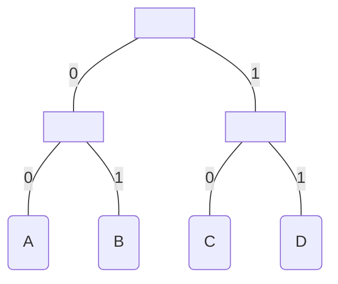

# Computation Structures

This subject is based on https://ocw.mit.edu/courses/electrical-engineering-and-computer-science/6-004-computation-structures-spring-2017/index.htm.

## Table of contents
[Basics of Information](#basics-of-information)  
[The Digital Abstraction](#the-digital-abstraction)  

## Basics of Information

Key questions:
- Why do I need to quantify such an abstract concept as information?
- Why do I need to quantify such an abstract concept as entropy?
  

1. It's any data that manages to reduce uncertainty.
2. Different pieces of data reduce uncertainty by different amounts. More reduction equals more information conveyed.
3. In 1948, Claude Shannon tried to quantify information as **I(xi) = log2(1/pi)**.  xi has a probability of pi of occurring. In other words, the lower the probability, the higher the information gained.
4. As an example, learning that a random deck card is a heart gives us: **I(heart) = log2(1/(13/52))**, which is equal to 2 bits.
5. Another way to look at this is: how can we encode the heart value? We have 4 possible values (each card suit), so the simplest way is to encode is to assign 00 to Diamonds, 01 to Clubs, 10 to Hearts and 11 to Spades.
6. Similarly, the entropy H(x) is the average amount of information contained in each piece of data received about the value x. That is, **H(x) = sum(pi * I(xi))**.
7. In this case, entropy is a guideline. In a sequence of data about certain values, we need to be as close as possible to entropy. If the bits used are lower, we won't be describing it properly. If the bits used are higher, we're being inefficient.
8. Encodings: unambiguous mapping between bit strings and a set of possible data. Similar to the thing we did with the card suits. There's variable-length encoding and fixed-length encoding.
9. You can use tables to represent encoding, such as:  

| A  | B  | C  | D  |
|----|----|----|----|
| 00 | 01 | 10 | 11 |

9. You can also use binary trees to represent encoding:

10.  If all choices are equally likely, then a fixed-length encoding is often used. This encoding generates a perfect binary tree, where all leaves are the same distance from the root (like the example above).
11.  In such case, since pi = 1/N (where N is the number of choices), entropy is defined as sum(1/N * log2(1/(1/N))), which is just log2N.
12.  Say we want to encode the numbers 0 through 9. That's 10 possible choices. The entropy says that we need log210 to encode it. That is 3.32 bits, rounding up to 4 bits, which is correct! 9 is represented as 1001 in binary. Note that we need 4 bits minimum, but 4 bits can represent up to 16 values (24)
13.  Thus, unsigned integers have a range of 0 -> 2N - 1, where N is the number of bits allocated.
14.  Similarly, signed integers waste one bit to represent the sign, so generally they have a range of -2N-1 - 1 -> 2N-1 - 1. However this type of encoding allows for two keys to represent the same value (0). Eg. when N = 2, 10 = -0 and 00 = +0!
15.  Two's complement encoding solves this by attributing the highest order bit a negative weight. The result is that, when N = 2, 11 is -(21) + 20 = -1. As an example, 10 = -2, 11 = -1, 00 = 0 and 01 = 1.
16.  Finding the negative value of A in 2's complement encoding is more complex as well. You basically negate A (known as find A's complement) and add 1 to it. Eg. when N = 3, say A = 2 = 010. So ~A = 101, 101 + 001 = 110. Just to check, 110 is -(22) + 21 = -4 + 2 = -2! Hurray!
17.  How did we arrive at this formula? A - A = 1 - 1, -A = 1 + (- 1 - A). Finally, -A = 1 + ~A (complement of A).
18.  Examples of fixed-length encoding include ASCII and hexadecimal notation (where 4 bits represent one symbol from 0 to F).
19.  Encodings such as the hexadecimal allow us to compress data, effectively reducing space consumption (but increasing time consumption in the encoding and decoding process).

## The Digital Abstraction

