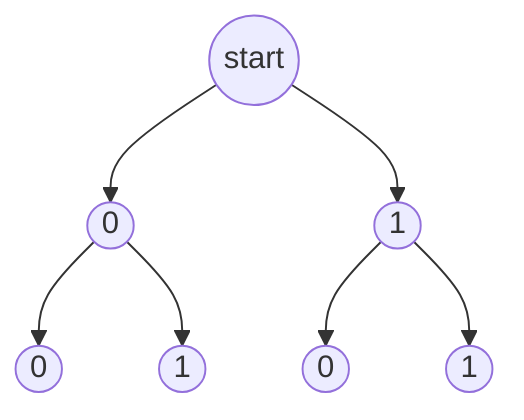

# Computation Structures

This subject is based on https://ocw.mit.edu/courses/electrical-engineering-and-computer-science/6-004-computation-structures-spring-2017/index.htm.

## Table of contents
[Basics of Information](#basics-of-information)  
[The Digital Abstraction](#the-digital-abstraction)  

## Basics of Information

0. It's any data that manages to reduce uncertainty.
1. Different pieces of data reduce uncertainty by different amounts. More reduction equals more information conveyed.
2. In 1948, Claude Shannon tried to quantify information as **I(xi) = log2(1/pi)**.  xi has a probability of pi of occurring. In other words, the lower the probability, the higher the information gained.
3. As an example, learning that a random deck card is a heart gives us: **I(heart) = log2(1/(13/52))**, which is equal to 2 bits.
4. Another way to look at this is: how can we encode the heart value? We have 4 possible values (each card suit), so the simplest way is to encode is to assign 00 to Diamonds, 01 to Clubs, 10 to Hearts and 11 to Spades.
5. Similarly, the entropy H(x) is the average amount of information contained in each piece of data received about the value x. That is, **H(x) = sum(pi * I(xi))**.
6. In this case, entropy is a guideline. In a sequence of data about certain values, we need to be as close as possible to entropy. If the bits used are lower, we won't be describing it properly. If the bits used are higher, we're being inefficient.
7. Encodings: unambiguous mapping between bit strings and a set of possible data. Similar to the thing we did with the card suits. There's variable-length encoding and fixed-length encoding.
8. You can use tables to represent encoding, such as:  

| A  | B  | C  | D  |
|----|----|----|----|
| 00 | 01 | 10 | 11 |

1. You can also use binary trees to represent encoding:

10. If all choices are equally likely, then a fixed-length encoding is often used. This encoding generates a perfect binary tree.

## The Digital Abstraction

