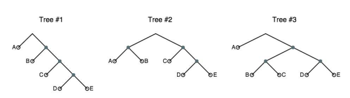

# Computation Structures Worksheet

This subject is based on https://ocw.mit.edu/courses/electrical-engineering-and-computer-science/6-004-computation-structures-spring-2017/index.htm.

## Table of contents
[Basics of Information](#basics-of-information)  
[The Digital Abstraction](#the-digital-abstraction)  

## Basics of Information

**{1}** You are given an unknown 3-bit binary number. You are then told that the binary representation contains exactly two 1’s. How much information have you been given?   
- [ ] log2(8/3) bits
- [ ] 8 bits
- [ ] log23 bits
- [ ] log2(2/8) bits
- [ ] log2(3/8) bits

**{2}** You are then given the additional information that the number is also odd. How much additional information have you been given? 
- [ ] log2(3/2) bits
- [ ] 3 bits
- [ ] log23 bits
- [ ] log2(2/3) bits
- [ ] log2(3/8) bits

**{3}** A random variable X represents the outcome of flipping an unfair coin, where p(HEADS) = 0.6. Please give the value for the entropy H(X).
- [ ] 0.97 bits
- [ ] 0.96 bits
- [ ] 0.98 bits
- [ ] 0.99 bits
- [ ] 0.95 bits

**{4}** A single decimal digit is chosen at random and you’re told that its value is 0 mod 3. How much information have you learned about the digit?
- [ ] log2(10/4) bits
- [ ] log2(1) bits
- [ ] log2(1/4) bits
- [ ] log2(10) bits
- [ ] log2(3) bits

**{5}** X is an unknown 8-bit binary number. You are given another 8-bit binary number, 10101100, and told that the Hamming distance between X and 10101100 is one. How many bits of information about X have you been given?
- [ ] 5 bits
- [ ] 4 bits
- [ ] 6 bits
- [ ] 3 bits
- [ ] 7 bits

**{6}** We wish to transmit messages comprised of the four symbols shown below with their associated probabilities and 5-bit fixed-length encoding. An unknown symbol is received and you are told it’s not delta. How much information have you received?
- [ ] log2(8/7) bits
- [ ] log2(8/5) bits
- [ ] log2(4) bits
- [ ] log2(4/3) bits
- [ ] log2(5/4) bits

| Symbol | p(symbol) | encoding |
|--------|-----------|----------|
| alpha  | 0.5       | 00000    |
| beta   | 0.125     | 11100    |
| gamma  | 0.25      | 11011    |
| delta  | 0.125     | 10111    |

**{7}** When transmitting a message comprised of these four symbols with the probabilities as given above, what is the expected amount of information received (also known as entropy) when you are told the next symbol in the message?
- [ ] 1.75 bits
- [ ] 1.5 bits
- [ ] 2 bits
- [ ] 1.25 bits
- [ ] 2.25 bits

**{8}** You are given an unknown 5-bit binary number. You are then told that the first and last bits are the same. How much information have you been given?
- [ ] 1 bit
- [ ] 1.5 bits
- [ ] 2 bits
- [ ] 1.25 bits
- [ ] 2.25 bits

**{9}** I've randomly selected a letter from the alphabet and tell you that my selection is neither "X", "Y", nor "Z". How much information have I given you about my letter?
- [ ] log2(26/23) bits
- [ ] 3 bits
- [ ] 1 bit
- [ ] log2(32/29) bits
- [ ] 2.25 bits

**{10}** I make up a random 4-bit two’s complement number by flipping a fair coin to determine each bit. You’re trying to guess the number. If I tell you that the number is positive (> 0), how many bits of information have I given you?
- [ ] log2(16/7) bits
- [ ] 3 bits
- [ ] 1 bit
- [ ] log2(32/29) bits
- [ ] 2.25 bits

**{11}** What is the 6-bit two’s complement representation of the decimal number -21?
- [ ] 101011
- [ ] 110101
- [ ] 100100
- [ ] 100101
- [ ] 100111

**{12}** What is the hexadecimal representation for decimal -51 encoded as an 8-bit two’s complement number?
- [ ] 0xCD
- [ ] 0xCC
- [ ] 0xDD
- [ ] 0xCA
- [ ] 0xDA

**{13}** The hexadecimal representation for an 8-bit two’s complement number is 0xD6. What is its decimal representation?
- [ ] -42
- [ ] -41
- [ ] -43
- [ ] -40
- [ ] -44

**{14}** Since the start of official pitching statistics in 1988, the highest number of pitches in a single game has been 172. Assuming that remains the upper bound on pitch count, how many bits would we need to record the pitch count for each game as a two’s complement binary number?
- [ ] 9 bits
- [ ] 8 bits
- [ ] 10 bits
- [ ] 7 bits
- [ ] 11 bits

**{15}** What is the sum of two 2’s complement numbers 0xB3 + 0x47 using an 8-bit 2’s complement representation? Please encode the result using hex. 
- [ ] 0xFA
- [ ] 0xFB
- [ ] 0xE9
- [ ] 0xFC
- [ ] Bit overflow

**{16}** What is the sum of two 2’s complement numbers 0xB3 + 0xB1 using an 8-bit 2’s complement representation? Please encode the result using hex. 
- [ ] Bit overflow
- [ ] 0xFB
- [ ] 0xE9
- [ ] 0xFC
- [ ] 0xE8

**{17}** Please compute the value of the expression 0xBB – 8 using 8-bit two’s complement arithmetic and give the result in decimal (base 10). 
- [ ] -77 
- [ ] -76
- [ ] -78
- [ ] -75
- [ ] -79

**{18}** What is the smallest (most negative) integer that can be represented as an 8-bit two’s complement integer? Give your answer as a decimal integer.
- [ ] -128
- [ ] -64
- [ ] -256
- [ ] -32
- [ ] -512

**{19}** In hexadecimal, using a 8-bit adder with 2's complement encoding, how much is 0xF0 + 0x34? 
- [ ] 0x24
- [ ] 0x92
- [ ] 0x23
- [ ] 0x91
- [ ] 0x93

**{20}** In hexadecimal, using a 8-bit adder with 2's complement encoding, how much is 0xF0 + 0x80? 
- [ ] 0x70
- [ ] 0xB8
- [ ] 0x71
- [ ] 0xB9
- [ ] 0x72

**{21}** Using a 5-bit two’s complement representation, what is the range of integers that can be represented with a single 5-bit quantity? 
- [ ] -16 to 15
- [ ] -16 to 16
- [ ] -32 to 31
- [ ] -32 to 32
- [ ] 0 to 32

**{22}** Using two's complement and 5 bits, how much is 10101 - 00011? Compute the result and give the answer as a decimal (base 10) number. 
- [ ] -14
- [ ] -7
- [ ] -16
- [ ] 8
- [ ] -8

**{23}** Given a variable X that can take on one of four values A, B, C, or D with the following probabilities. 

| Symbol | Probability |
|--------|-------------|
| A      | 0.5         |
| B      | 0.3         |
| C      | 0.1         |
| D      | 0.1         |

If you encoded this variable using a Huffman encoding, how many bits would be in the encoding of each of the symbols? 
- [ ] A = 1, B = 2, C = 3, D = 3 
- [ ] A = 1, B = 2, C = 4, D = 4
- [ ] A = 1, B = 2, C = 2, D = 2
- [ ] A = 1, B = 3, C = 4, D = 4
- [ ] A = 1, B = 2, C = 5, D = 5

**{24}** Which of the following trees describes the following probability distribution?
`p(A) = 0.3, p(B) = 0.3, p(C) = 0.2, p(D) = 0.1, p(E) = 0.1`

- [ ] Tree 2
- [ ] Tree 1
- [ ] Tree 3

**{25}** Given the same trees, which one describes the following probability distribution?
`p(A) = 0.6, p(B) = 0.1, p(C) = 0.1, p(D) = 0.1, p(E) = 0.1`
- [ ] Tree 3
- [ ] Tree 2
- [ ] Tree 1

**{26}** Given the same trees, which one describes the following probability distribution?
`p(A) = 0.5, p(B) = 0.15, p(C) = 0.15, p(D) = 0.1, p(E) = 0.1`
- [ ] Tree 3       
- [ ] Tree 2
- [ ] Tree 1

**{27}** Given the same trees, which one describes the following probability distribution?
` p(A) = 0.5, p(B) = 0.2, p(C) = 0.15, p(D) = 0.05, p(E) = 0.1`
- [ ] Tree 1
- [ ] Tree 3       
- [ ] Tree 2

**{28}** The table below shows some fun baseball probabilities (from 2014). How much information have you received when learning that particular pitch was NOT a fastball?

| Type of pitch | Probability |
| --------------|-------------|
| Fastball      | 0.34        |
| Change-up     | 0.14        |
| Curveball     | 0.08        |
| Slider        | 0.28        |  
| Other         | 0.16        |
- [ ] log2(1/0.66) 
- [ ] log2(0.66) 
- [ ] 0.66 * log2(0.66) 
- [ ] log2(0.34) 
- [ ] 0.34 * log2(1/0.34) 

**{29}** Using Huffman's algorithm, what's the most efficient variable length encoding for the table above?
- [ ] CB = 000, CU = 001, O = 01, S = 10, FB = 11
- [ ] CB = 0, CU = 1, O = 10, S = 11, FB = 100
- [ ] CB = 100, CU = 11, O = 10, S = 1, FB = 0
- [ ] CB = 00, CU = 01, O = 010, S = 011, FB = 100
- [ ] CB = 00, CU = 01, O = 010, S = 011, FB = 111

**{30}** The table below shows the 2012-13 enrollments in the various EECS majors. To save a bit of space in their database the department would like to use a variable-length Huffman code to encode a student’s choice of major. Choose the best encoding for each major.
| Major | Count | p    | p*log2(1/p) |
|-------|-------|------|------------------------|
| 6-1   | 74    | 0.09 | 0.30                   |
| 6-2   | 387   | 0.44 | 0.52                   |
| 6-3   | 360   | 0.41 | 0.053                  |
| 6-7   | 54    | 0.06 | 0.25                   |
| Total | 875   | 1.00 | 1.60                   |
- [ ] 6-1 = 001, 6-2 = 1, 6-3 = 01, 6-7 = 000
- [ ] 6-1 = 000, 6-2 = 001, 6-3 = 01, 6-7 = 10
- [ ] 6-1 = 0, 6-2 = 1, 6-3 = 10, 6-7 = 11
- [ ] 6-1 = 10, 6-2 = 11, 6-3 = 01, 6-7 = 1
- [ ] 6-1 = 11, 6-2 = 001, 6-3 = 01, 6-7 = 10

**{{31}}** We wish to transmit messages comprised of the four symbols shown below with their associated probabilities and 5-bit fixed-length encoding.
| Symbol | p(symbol) | encoding |
|--------|-----------|----------|
| α      | 0.5       | 00000    |
| β      | 0.125     | 11100    |
| γ      | 0.25      | 11011    |
| δ      | 0.125     | 10111    |
Huffman’s algorithm is used to construct a variable-length code for the four symbols for transmitting a single symbol at a time. The resulting encoding could be:
- [ ] None of the above.
- [ ] α: 0, β: 110, γ: 01, δ: 111 
- [ ] α: 00, β: 01, γ: 10, δ: 10 
- [ ] α: 00, β: 01, γ: 100, δ: 101 
- [ ] α: 1, β: 01, γ: 000, δ: 001

**{{32}}** Five messages, and their relative probabilities, are listed below: 
| id | Message                         | p   |
|----|---------------------------------|-----|
| M1 | Send money!                     | 60% |
| M2 | I love this course called 6.004 | 8%  |
| M3 | I’m changing my major to Poetry | 2%  |
| M4 | I’m getting a 5.0 this term     | 1%  |
| M5 | Nothing much is new…            | 29% |
What is the average number of bits needed to convey a message, using a fixed-length code?
- [ ] 3 bits.
- [ ] 4 bits.
- [ ] 2 bits.
- [ ] 2.5 bits.
- [ ] 4.5 bits.

**{{33}}** Given the probability distribution of the messages, what is the actual amount of information conveyed by message M5? Your answer may be a formula. 
- [ ] I(M5) = log2(1/0.29)
- [ ] I(M5) = log2(1/29)
- [ ] I(M5) = log2(0.29)
- [ ] I(M5) = log2(29)
- [ ] I(M5) = 29 log2(0.29)

**{{34}}** To enable error correction, the fixed-length code (3 bits) for a given message is sent five times. Using the five copies of the received message, in the worst case how many bit errors can be corrected at the receiver?
- 2
- 1
- 5
- 3
- 4

**{{35}}** Give the number of bits sent by your Huffman code for each message (M1 though M5), and the average number of bits transmitted per message using your code (a formula will be fine).
- M1 = 1, M5 = 01, M2 = 001, M3 = 0001, M4 = 0000. Average = 1.54 bits.
- M1 = 1, M5 = 0, M2 = 10, M3 = 11, M4 = 00. Average = 1.5 bits.
- M1 = 0, M5 = 01, M2 = 001, M3 = 0001, M4 = 0000. Average = 1.5 bits.
- M1 = 1, M5 = 01, M2 = 001, M3 = 0001, M4 = 1000. Average = 1.5 bits.
- M1 = 0, M5 = 01, M2 = 001, M3 = 0001, M4 = 0000. Average = 1.54 bits.

## The Digital Abstraction

