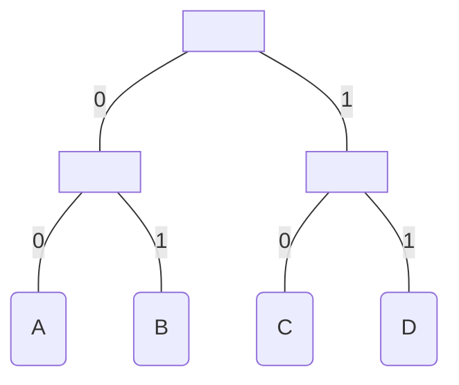
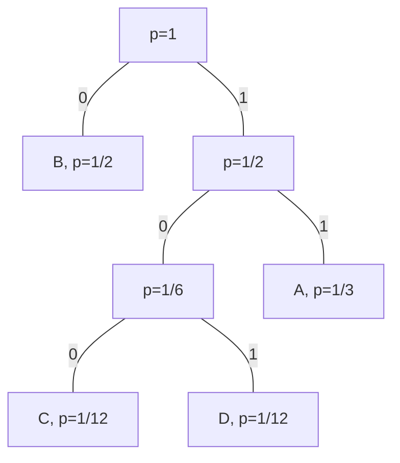

# Computation Structures

This subject is based on https://ocw.mit.edu/courses/electrical-engineering-and-computer-science/6-004-computation-structures-spring-2017/index.htm.

## Table of contents
[Basics of Information](#basics-of-information)  
[The Digital Abstraction](#the-digital-abstraction)  

## Basics of Information

Key questions:
- Why do I need to quantify such an abstract concept as information?
- Why do I need to quantify such an abstract concept as entropy?

**{1}** It's any data that manages to reduce uncertainty. 
**{2}** Different pieces of data reduce uncertainty by different amounts. More reduction equals more information conveyed. 
**{3}** In 1948, Claude Shannon tried to quantify information as ***I(xi) = log2(1/pi)***.  xi has a probability of pi of occurring. In other words, the lower the probability, the higher the information gained. 
**{4}** As an example, learning that a random deck card is a heart gives us: ***I(heart) = log2(1/(13/52))***, which is equal to 2 bits. 
**{5}** Another way to look at this is: how can we encode the heart value? We have 4 possible values (each card suit), so the simplest way is to encode is to assign 00 to Diamonds, 01 to Clubs, 10 to Hearts and 11 to Spades. 
**{6}** Similarly, the entropy H(x) is the average amount of information contained in each piece of data received about the value x. That is, ***H(x) = sum(pi * I(xi))***. 
**{7}** In this case, entropy is a guideline. In a sequence of data about certain values, we need to be as close as possible to entropy. If the bits used are lower, we won't be describing it properly. If the bits used are higher, we're being inefficient. 
**{8}** Encodings: unambiguous mapping between bit strings and a set of possible data. Similar to the thing we did with the card suits. There's variable-length encoding and fixed-length encoding. 
**{9}** You can use tables to represent encoding, such as: 

| A  | B  | C  | D  |
|----|----|----|----|
| 00 | 01 | 10 | 11 |

**{10}** You can also use binary trees to represent encoding: 

**{11}** If all choices are equally likely, then a fixed-length encoding is often used. This encoding generates a perfect binary tree, where all leaves are the same distance from the root (like the example above). 
**{12}** In such case, since ***pi = 1/N*** (where N is the number of choices), entropy is defined as ***sum(1/N * log2(1/(1/N)))***, which is just ***log2N***. 
**{13}** Say we want to encode the numbers 0 through 9. That's 10 possible choices. The entropy says that we need log210 to encode it. That is 3.32 bits, rounding up to 4 bits, which is correct! 9 is represented as 1001 in binary. Note that we need 4 bits minimum, but 4 bits can represent up to 16 values (24). 
**{14}** Thus, unsigned integers have a range of ***0 -> 2N - 1***, where N is the number of bits allocated. 
**{15}** Similarly, signed integers waste one bit to represent the sign, so generally they have a range of ***-2N-1 - 1 -> 2N-1 - 1***. However this type of encoding allows for two keys to represent the same value (0). Eg. when N = 2, 10 = -0 and 00 = +0. 
**{16}** Two's complement encoding solves this by attributing the highest order bit a negative weight. The result is that, when N = 2, ***11 is -(21) + 20 = -1***. As an example, 10 = -2, 11 = -1, 00 = 0 and 01 = 1. 
**{17}** Finding the negative value of A in 2's complement encoding is more complex as well. You basically negate A (known as find A's complement) and add 1 to it. Eg. when N = 3, say ***A = 2 = 010***. So ***~A = 101, 101 + 001 = 110***. Just to check, 110 is ***-(22) + 21 = -4 + 2 = -2***. 
**{18}** How did we arrive at this formula? ***A - A = 1 - 1, -A = 1 + (- 1 - A)***. Finally, ***-A = 1 + ~A*** (complement of A). 
**{19}** Examples of fixed-length encoding include ASCII and hexadecimal notation (where 4 bits represent one symbol from 0 to F). 
**{20}** Encodings such as the hexadecimal allow us to compress data, effectively reducing space consumption (but increasing time consumption in the encoding and decoding process). 
**{21}** Variable-length encodings are used when probabilities are irregular. In such cases, low information represent high probabilities and vice-versa, according to Shannon's law (item 3). For instance: 

| choice | p    | encoding |
|--------|------|----------|
| A      | 1/3  | 11       |
| B      | 1/2  | 0        |
| C      | 1/12 | 100      |
| D      | 1/12 | 101      |

**{22}** The encoding above has an expected length of 1.667, which is more efficient than a fixed-length encoding in this case (which would have an entropy of 2). 
**{23}** Note that the expected length is 1.667, but given the probabilities, the entropy (lower bound) is 1.626. So there must be another encoding that's more efficient. 
**{24}** To find the optimal encoding, we can use Huffman's Algorithm. Just build the binary tree from the ground, choosing the lowest probabilities, combining them and repeating until you reach probability = 1. Using the table in item 20, we get: 

**{25}** Notice that this algorithm reached the same encoding that we had, providing no further improvement. 
**{26}** To improve encodings, we can try to combine the pairs. Since we have 4 primitive choices (A,B,C,D), we'll end up with 16 pairs, where each pair has a new probability. For example, the AC pair has a probability of 1/36 (since that's the product of 1/3 * 1/12). 
**{27}** With these new probabilities, we can arrive at the entropy of 1.646, which is significantly better. 
**{28}** Entering the realm of errors, we have an important concept called Hamming Distance. 
**{29}** The Hamming Distance is given by the number of positions in which the corresponding digits differ in two encodings of the same length. E.g.: 100 and 101 has a distance of 1. Or 111 and 100 has a distance of 2. 
**{30}** Single bit errors always have a Hamming Distance of 1 when compared to the original encoding. 
**{31}** Simple encodings (1 bit encodings) are terrible in this aspect. A small, single-bit error can change the value entirely. 
**{32}** To improve our error detection, a parity bit is introduced in order to make the number of '1' bits even (if it's odd). 
**{33}** E.g: 0 for heads and 1 for tails is now 00 for heads and 11 for tails. Notice how the single-bit errors of these encodings have an odd number of '1' bits (10 or 01). Also note that this only works if there is an odd number of single-bit errors. 
**{34}** In general, to detect multi-bit E errors, we need a minimum Hamming Distance of ***E+1*** between code words. E.g: For HD = 2, 00 = heads and 11 = tails detects 1 bit errors. For HD = 3, 000 = heads and 111 = tails detects 2 bit errors. 
**{35}** Additionally, multi-bit E errors can be corrected with a ***2E + 1*** encoding. E.g: HD(000, 111) = 3, when applying a 1-bit error gives us 100, 010, 001 which is a 000 and 011, 101, 110 which is a 111. 

## The Digital Abstraction

